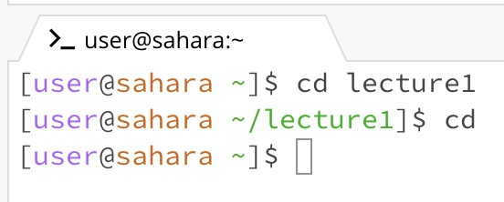

# Lab Report 1

## `cd` Command

**Example 1: No Argument**

Absolute path: /Users/berlenzhang/lecture1

This result was achieved because when you run the `cd` command with no argument. It takes you to the home directory. This is not an error because the `cd` command can be used without an argument. 

