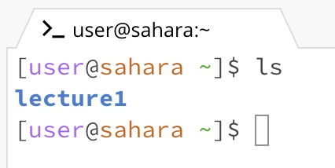
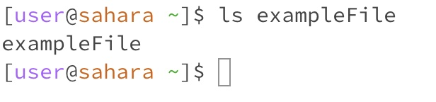
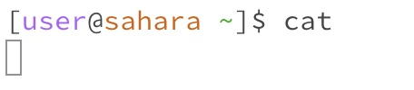
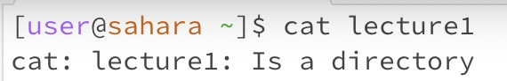
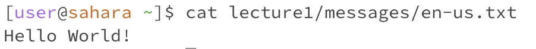

# cd Command

The above image shows the `cd` command being ran without any arguments. The working directory when the command was run is home. The output was that nothing changed. This is because the working directory when the command was run was already `/home`. If the directory was anything else, it would have changed the working directory to home. The command was not an error because the `cd` command can be used without an argument.

The above image shows the `cd` command being ran with a directory path as an argument. The working directory when the command was run is `/home`. The result of running the code is that the working directory gets changed according to the argument. In this case the working directory becomes lecture1. This is not an error because the command `cd` can be used with a directory path as an argument.

The above image is an example of the `cd` command being ran with a file name as an argument. The working directory when the command was run is `/home`. Running the code resulted in an error. This is because the command `cd` does not take a file name as an argument. 

# ls command

The above image is an example of the `ls` command being ran with no argument. The working directory when the command was run is home. The output of the command being run is `/home/lecture1`. This is because the command lists the avaiable directory paths from where you are. This is not an error. 

The above image is an example of the `ls` command being ran with a directory path as an argument. The working directory when the command was run is `/home`. The output of the command being run is shown in the image. It is a list of the directory paths from the folder lecture1, which was the argument. This is not an error because a directory is accepted as an argument for the `ls` command.

The above image is an example of the `ls` command being ran with a path to a file as an argument. The working directory when the command was run is `/home`. The output of the command being run is the name of the file. That is what happens when the command `ls` receives a file name as an argument. This is not an error.

# cat command

The above image shows an example of the `cat` command being ran without any argument. The working directory while the command is ran is `/home`. There was no output to the command. This is because the `cat` command returns the text in the file given in the argument. Without an argument, there is nothing to read. 

The above image is an example of the `cat` command being ran with a directory path as an argument. The working directory when the command was run is `/home`. The output of the command being run is this message: cat: `lecturel: Is a directory`. This is the output because the cat command only takes in file paths as an argument. It is an error.

The above image is an example of the `cat` command being ran with the path to a file as an argument. The working directory when the command was run is `/home`. The output of the command is this text: `'Hello World!'`. This is because the `cat` command returns the text that is in the file given as an argument. It is not an error. 
