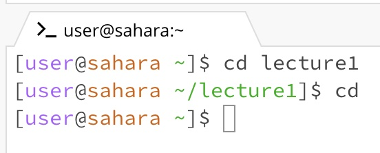
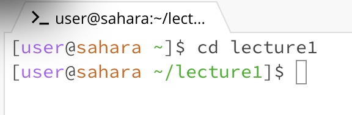
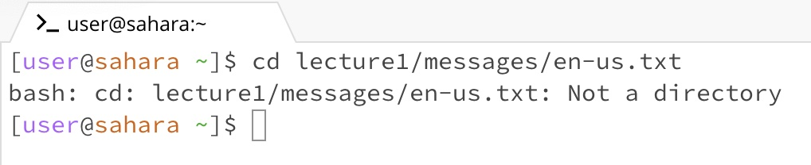

#cd Command

The above image shows the `cd` command being ran without any arguments. The working directory when the command was run is home. The output was that nothing changed. This is because the working directory when the command was run was already home. If the directory was anything else, it would have changed the working directory to home. The command was not an error because the `cd` command can be used without an argument.

The above image shows the `cd` command being ran with a directory path as an argument. The working directory when the command was run is home. The result of running the code is that the working directory gets changed according to the argument. In this case the working directory becomes lecture1. This is not an error because the command `cd` can be used with a directory path as an argument.

The above image is an example of the `cd` command being ran with a file name as an argument. The working directory when the command was run is home. Running the code resulted in an error. This is because the command `cd` does not take a file name as an argument. 

