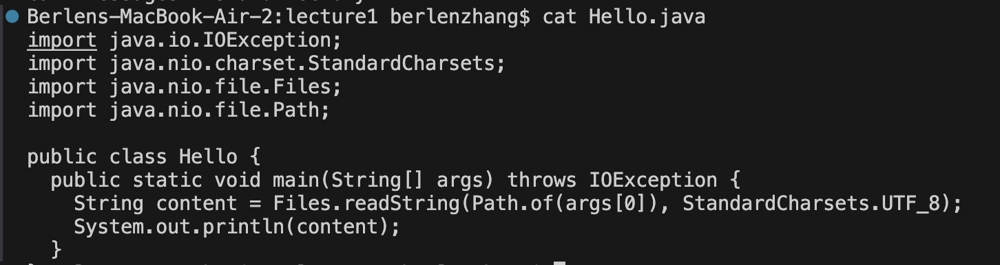

# Lab Report 1

## `cd` Command

**Example 1: No Argument**

Absolute path: /Users/berlenzhang/lecture1

This result was achieved because when you run the `cd` command with no argument. It takes you to the home directory. This is not an error because the `cd` command can be used without an argument. 

**Example 2: Directory Path**

Absolute path: /Users/berlenzhang/lecture1

This result was yielded when you run the `cd` command with a directory path as an argument. It changes the working directory to the `messages` directory. This is not an error because the `cd` command can be used to change directories into another directory.

**Example 3: File Path**

Absolute path: /Users/berlenzhang/lecture1/messages

This is what happens when you run the `cd` command with a file name as an argument. It results in an error message because the `cd` command can not change the directory into a file. It is an error because the cd command can not accept file names as arguments.

## `ls` Command

**Example 1: No Argument**

Absolute path: /Users/berlenzhang/lecture1

This is what happens when you run the `ls` command with no argument. It lists the available directory paths from the working directory. This is not an error because the `ls` command can be used with no argument.

**Example 2: Directory Path**

Absolute path: /Users/berlenzhang/lecture1

This is what happens when you run the `ls` command with a directory name as an argument. The result is a list of the available paths from the directory that was used as an argument. This is not an error because a directory name is an acceptable argument for the `ls` command. 

**Example 3: File Path**

Absolute path: /Users/berlenzhang/lecture1

This is the result yielded when you run the `ls` command with a file name as an argument. The result is the name of the file. This is what happens when `ls` is used with a file as an argument. This is not an error.

## `cat` Command

**Example 1: No Argument**

Absolute path: /Users/berlenzhang/lecture1

This result is yielded when you run the `cat` command with no argument. The output is empty because there is no file provided for the command to read. This is not an error.

**Example 2: Directory Path**

Absolute path: /Users/berlenzhang/lecture1

This is the result yielded from running the `cat` comand with a directory as an argument. The output is a message indicating that the given argument was a directory. This is an error because the `cat` command does not accpet directories as an argument.

**Example 3: File Path**

Absolute path: /Users/berlenzhang/lecture1

This is the result when running the `cat` command with a file name as the argument. It outputs all the contents of the given file. This is not an error. 
