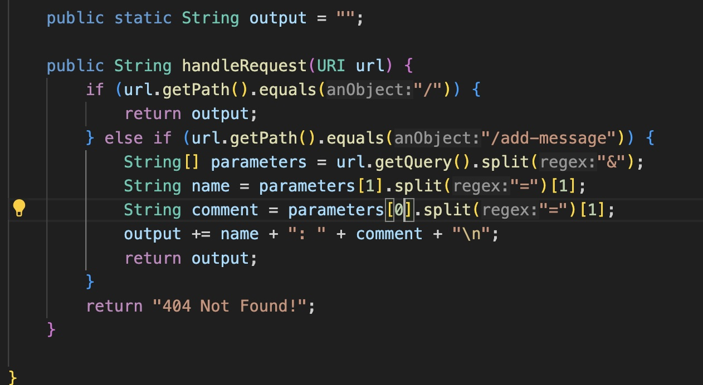
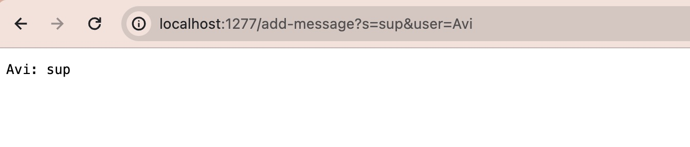
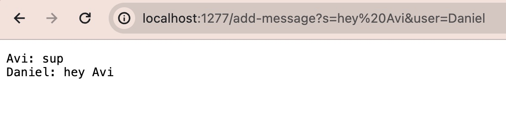
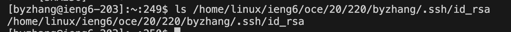
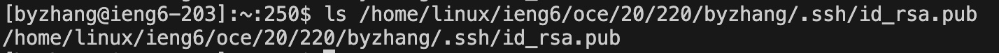
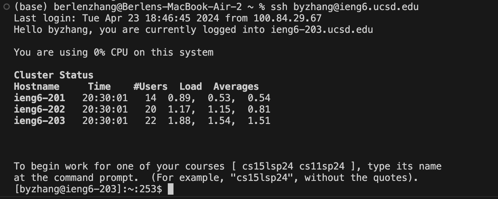

# Lab Report 2

## Part 1

**ChatServer Code**

**Screenshot 1**

The method called was `handleRequest`. The relevant argument to this method is the input url. A relevant field of the class is the class variable `output`. The value of `output` changed from an empty string to the string `"Avi: sup"` due to this request.

**Screenshot 2**

The method called was `handleRequest`. The relevant argument to this method is the input url. A relevant field of the class is the class variable `output`. The value of `output` changed from the string `"Avi: sup"` to the string `"Avi: sup\nDaniel: hey Avi"` due to this request.

## Part 2

