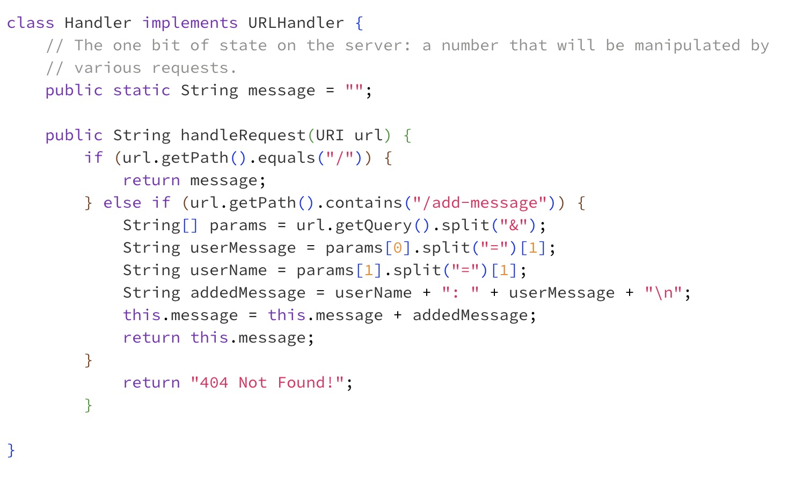
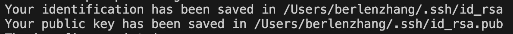
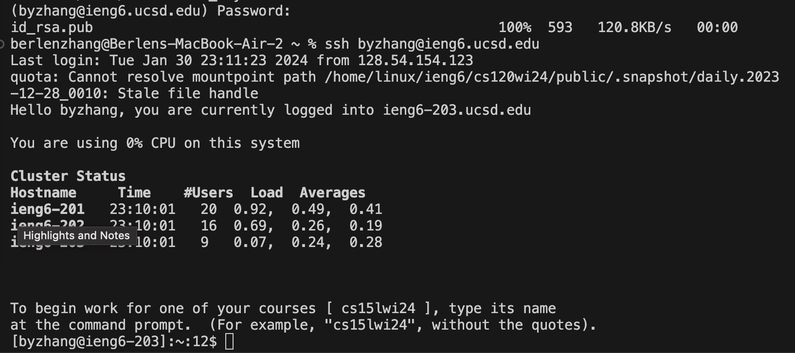

**My Code**

**First Screenshot**

The method being used in the picture above is the `add-message` function. The relevant arguments are the message `hi` and the user `berlen`. The value of the static variable `message` changes. The message that is displayed in the screenshot will be added to the string variable `message`. 

**Second Screenshot**

The method being used in the above image is the `add-message` function. The relevant arguments are the message `hello` and the user `vlad`. The string value `vlad: hello` will be added to the static variable `message` in the class. 

**Private and Public Keywords**

The first line in the above image is shows the absolute path to the private key. The second line shows the absolute path to the public key.

**Log In Without Password**

**Something I Learned**

Just about everything we did in this lab was completely new to me. One thing in particular that I found to be interesting is writing the ChatServer. I liked coding something that I could interact with.
