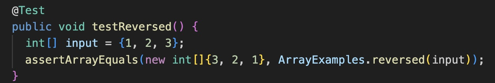
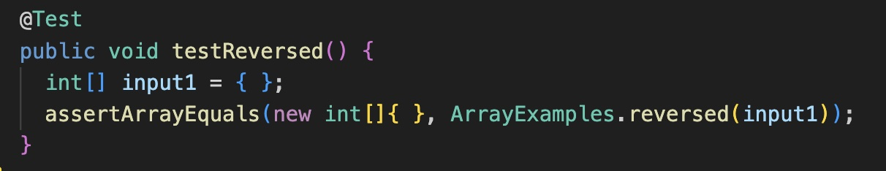
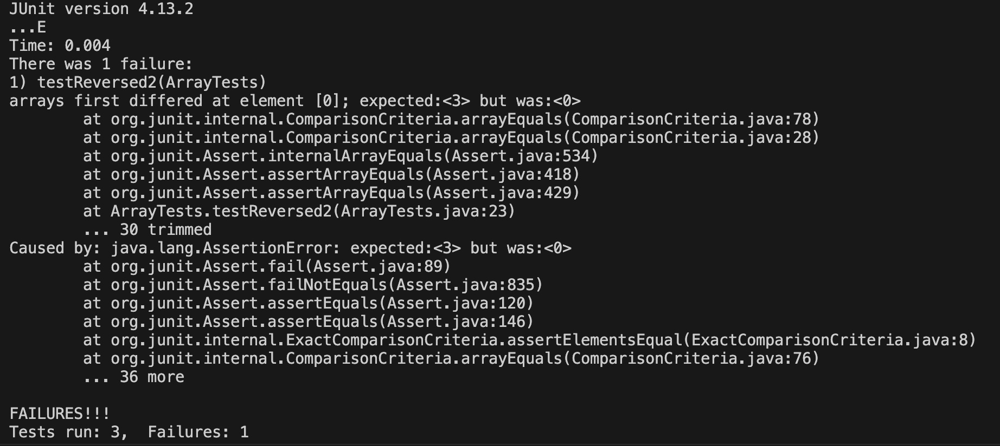
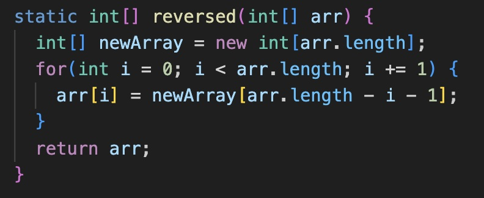
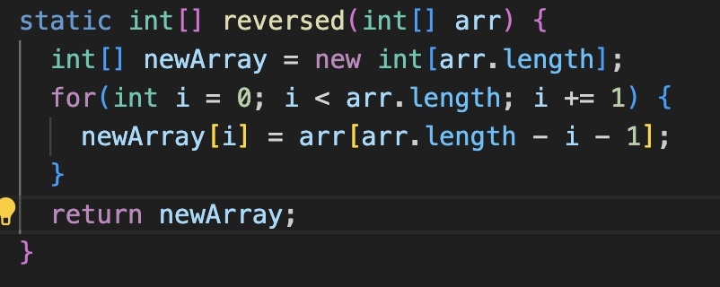

## Lab Report 3

# Part 1

**Failure inducing input:**



**Passing input:**



**Symptom:**



**Before Code**



**After Code**



The reason for the code failing was it was taking the values of `newArray` and inserting it into `arr`. `newArray` is an array full of zeros. The change fixed this issue by taking values from the input array `arr` and putting them into an empty array `newArray`. 

# Part 2

**G Command**

Command input 1: pressing G after running `less technical/911report/chapter-1.txt`

Command output 2: 

```
The details of what happened on the morning of September 11 are complex, but they play out a simple theme. NORAD and the FAA were unprepared for the type of attacks launched against the United States on September 11, 2001. They struggled, under difficult circumstances, to improvise a homeland defense against an unprecedented challenge they had never before encountered and had never trained to meet.

    At 10:02 that morning, an assistant to the mission crew commander at NORAD's Northeast Air Defense Sector in Rome, New York, was working with his colleagues on the floor of the command center. In a brief moment of reflection, he was recorded remarking that "This is a new type of war."

    He was, and is, right. But the conflict did not begin on 9/11. It had been publicly declared years earlier, most notably in a declaration faxed early in 1998 to an Arabic-language newspaper in London. Few Americans had noticed it. The fax had been sent from thousands of miles away by the followers of a Saudi exile gathered in one of the most remote and impoverished countries on earth.

                
        
(END)
```

Command input 1: 

Command output 2: 

```
Although the evidence presented here demonstrates that there is a long way to go before
        developing countries contribute a more equitable share to the international scientific
        community, there are also reasons to be optimistic. The relative increase in the number of
        publications, especially when corrected for the amount of money available in research and
        development, demonstrates that many developing countries are heading in the right
        direction. The extremely high scientific productivity of many developing nations, corrected
        for and despite the rather limited availability of funds, suggests that increased funding
        to the sciences will be an excellent investment by developing nations in terms of
        publications as a measure of scientific output, particularly if these publications can
        target the journals that have the greatest impact. Although there may still be a long road
        to travel, we feel optimistic that the bridges mentioned by Mr. Annan are slowly being
        built.
      
    
  
~
~
~
~
~
~
~
~
~
~
(END)
```

The source for this command is [https://phoenixnap.com/kb/less-command-in-linux]. This command is used to skip to the end of a file after you run `less`. This command can be useful when you are dealing with long files and you do not want to have to scroll down to the end of it.

**`less -N` Command**


