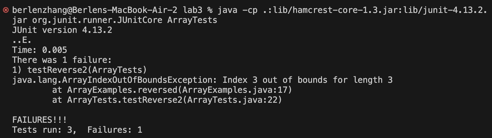

# Bugs

**Failure Inducing Input:**

`@Test
  public void testReverse2() {
    int[] input2 = {1, 2, 3};
    assertArrayEquals(new int[]{3, 2, 1}, ArrayExamples.reversed(input2));
  }
`

**Successful Input:**

`@Test
  public void testReversed() {
    int[] input1 = { };
    assertArrayEquals(new int[]{ }, ArrayExamples.reversed(input1));
  }
`

**Symptom:**

