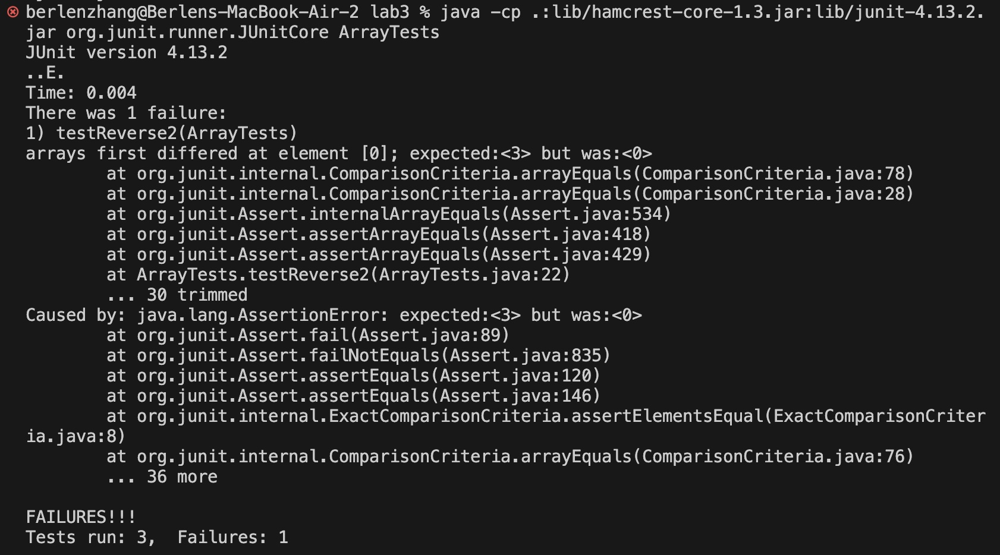

# Bugs

**Failure Inducing Input:**

`@Test
  public void testReverse2() {
    int[] input2 = {1, 2, 3};
    assertArrayEquals(new int[]{3, 2, 1}, ArrayExamples.reversed(input2));
  }
`

**Successful Input:**

`
@Test
  public void testReversed() {
    int[] input1 = { };
    assertArrayEquals(new int[]{ }, ArrayExamples.reversed(input1));
  }
`

**Symptom:**

**Before**

`static int[] reversed(int[] arr) {
    int[] newArray = new int[arr.length];
    for(int i = 0; i < arr.length; i += 1) {
      arr[i] = newArray[arr.length - i - 1];
    }
    return arr;
  }
`

**After**

`static int[] reversed(int[] arr) {
    int[] newArray = new int[arr.length];
    for(int i = 0; i < arr.length; i += 1) {
      newArray[i] = arr[arr.length - i - 1)];
    }
    return newArray;
  }
`

The issue with the code shown in the before image was that it was taking values from the `newArray` and using them to replace elements in `arr`. Since `newArray` is an empty array, the code would just replace all the values of the given array with zeros. The after code fixed this issue by taking the values from the first array and inserting them into the empty `newArray` backwards. Then, `newArray` is returned.

# Researching Commands

**`less -N` Command From Source https://www.geeksforgeeks.org/less-command-linux-examples/**

Input 1: `less -N technical/911report/chapter1.txt`

Output 1:
`
1 
      2         
      3                 
      4 "WE HAVE SOME PLANES"
      5 
      6     Tuesday, September 11, 2001, dawned temperate and nearly cloudless in the eastern 
      6 United States. Millions of men and women readied themselves for work. Some made their 
      6 way to the Twin Towers, the signature structures of the World Trade Center complex in 
      6 New York City. Others went to Arlington, Virginia, to the Pentagon. Across the Potomac
      6  River, the United States Congress was back in session. At the other end of Pennsylvan
      6 ia Avenue, people began to line up for a White House tour. In Sarasota, Florida, Presi
      6 dent George W. Bush went for an early morning run.
      7 
      8     For those heading to an airport, weather conditions could not have been better for
      8  a safe and pleasant journey. Among the travelers were Mohamed Atta and Abdul Aziz al 
      8 Omari, who arrived at the airport in Portland, Maine.
      9 
      `

**`less -m` Command From Source https://man7.org/linux/man-pages/man1/less.1.html**

**`&pattern` Command From Source https://phoenixnap.com/kb/less-command-in-linux**

**`G` Command From Source https://linux.die.net/man/1/less**
