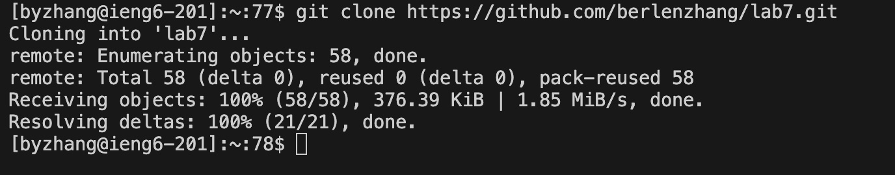
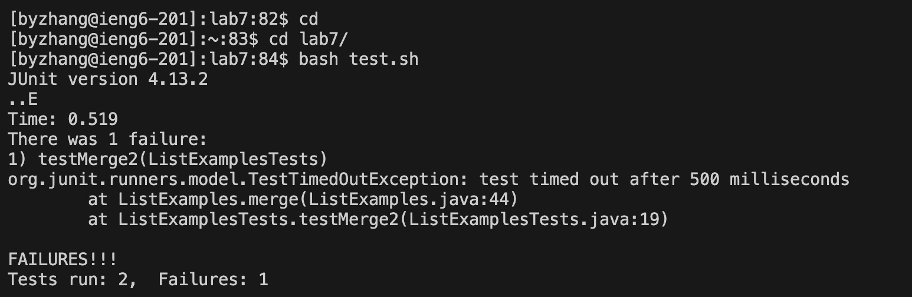
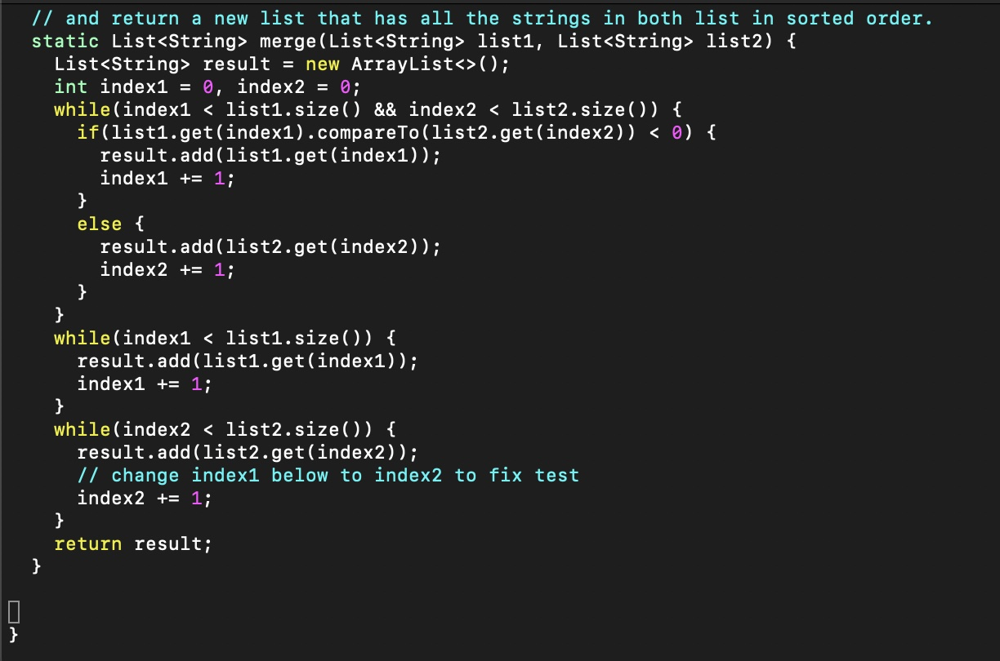
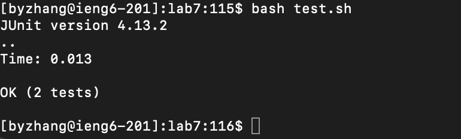
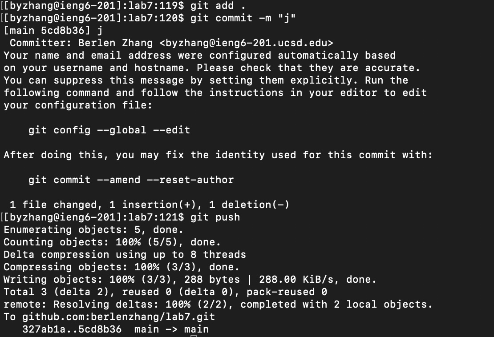

# Lab Report 3

**Step 4:**

Keys Pressed: `ssh byzhang@ieng6.ucsd.edu <enter>` Procedure for logging into ieng6.

**Step 5:**

Keys Pressed: `git clone <Command V> <enter>` Procedure for cloning a repository. The `<Command V` was me pasting the repository URL.

**Step 6:**

Keys Pressed: `cd la<Tab><Enter>`, `bash t<Tab><Enter>` The first command was to change directories into `lab7`. I hit `<Tab>` after only typing the first two letters of the directory name `lab7`. This autofilled the rest of the directory name. The second command was to run the tests in `test.sh`. I also used `<Tab>` to autofill. 

**Step 7:**

Keys Pressed: 

**Step 8:**

Keys Pressed: 

**Step 9:**

Keys Pressed: 

