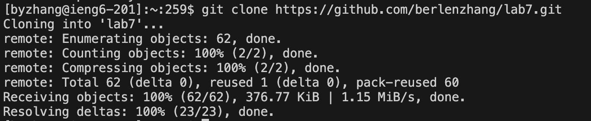

## Lab Report 4

# Step 4:

Keys pressed: ssh\<space>byzhang@ieng6.ucsd.edu\<enter>

Explanation: Logging into ieng6

# Step 5:

Keys pressed: git\<space>clone\<space>\<command V>

Explanation: This step cloned the `lab7` repository. The <command V> pastes the URL of the repository.

# Step 6:

Keys pressed: cd\<space>l\<tab>\<enter>bash\<space>t\<tab>\<enter>

Explanation: First, I changed directory into the `lab7` directory. Then, I used the `bash` command to run the test script.

# Step 7:

Keys pressed pt. 1: vim\<space>L\<tab>.\<tab>\<enter>

Explanation: This is to open the `ListExamples.java` file in vim.

Keys pressed pt. 2: 43j 3e x i 2 \<esc> :wq 
