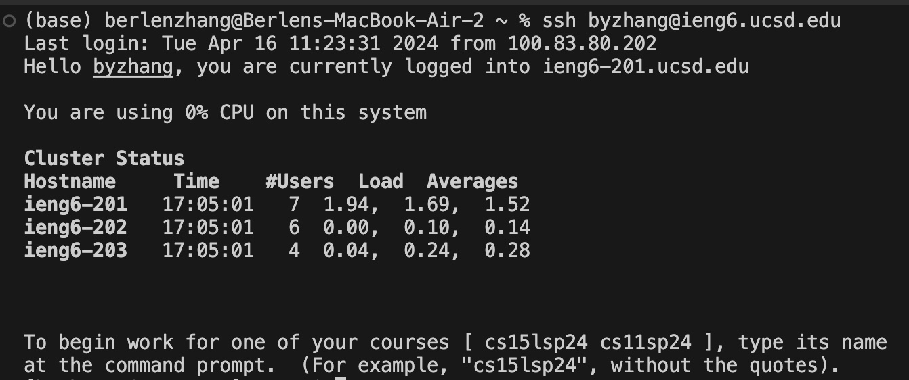
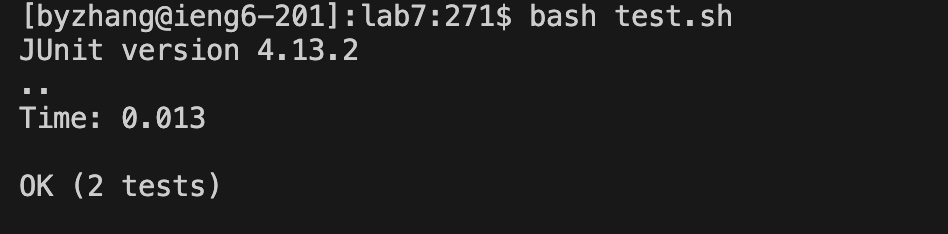
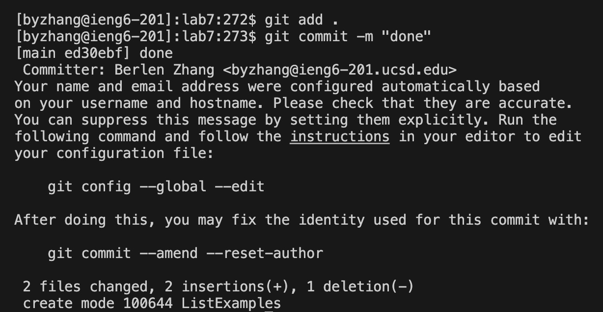

## Lab Report 4

# Step 4:

Keys pressed: ssh`<space>`byzhang@ieng6.ucsd.edu`<enter>`

Explanation: Logging into ieng6

# Step 5:

Keys pressed: git`<space>`clone`<space>``<command V>``<enter>`

Explanation: This step cloned the `lab7` repository. The \<command V> pastes the URL of the repository.

# Step 6:

Keys pressed: cd\<space>l\<tab>\<enter>bash\<space>t\<tab>\<enter>

Explanation: First, I changed directory into the `lab7` directory. Then, I used the `bash` command to run the test script.

# Step 7:

Keys pressed pt. 1: vim\<space>L\<tab>.\<tab>\<enter>

Explanation: This is to open the `ListExamples.java` file in vim.

Keys pressed pt. 2: 43j 1e x i 2 \<esc> :wq 

Explanation: I run these commands after the file opens in vim to edit the contents of the file. `43j` jumps to the line I want to edit, `1e` jumps to the character I want to edit, `x` deletes that character, `i` allows me to type in the file, I type `2` to replace the 1 I deleted earlier, \<esc> takes me out of typing mode, and :wq exits vim.

# Step 8: 

Keys pressed: bash\<space>t\<tab>\<enter>

Explanation: This is to rerun the test script.

# Step 9:

Keys pressed: git\<space>add\<space>.\<enter> git\<space>commit\<space>-m\<space>"done"\<enter>

Explanation: This commits and pushes the edits made to GitHub.
