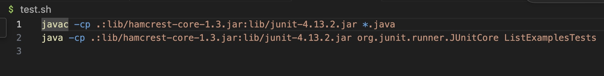

# Lab Report 5

## Part 1: Debugging Scenario

**Student:**
Hi. I can't seem to find the bug in my `toLowerArray` function. I believe there is something wrong with my for-loop or the way I'm assigning values to the output array. Below is my code and my symptom.

**TA:**
Hello! Your for-loop is fine. My suggestion for you would be to pay attention to what variable you are calling `toLowerCase` on and putting into the output array. 

---

**Description:**
The mistake that the student was making was that they were calling `.toLowerCase` on the values in the empty output array `lowerArr` and assigning them to the same array. To fix this, they changed the second `lowerArr` on line 14 to `strings`.

**Fixed Code:**

**Files Before Fixing Bug**

**File & Directory Structure**

* lab7
  * ListExamples.java
  * ListExamplesTest.java
  * test.sh
 
## Part 2: Reflection

My favorite thing from the second half of taking this class was learning how to use a debugger.I had not heard of using debuggers before this, but I feel like there are many times in the past where using one would have saved me a lot of time. It seems like a very useful tool code tracing when code gets complicated.
