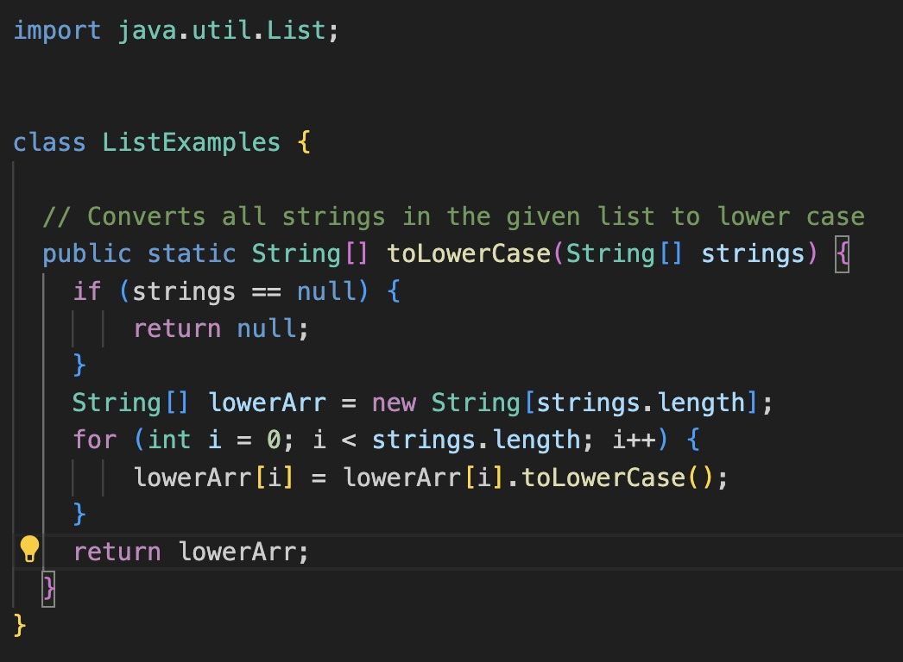
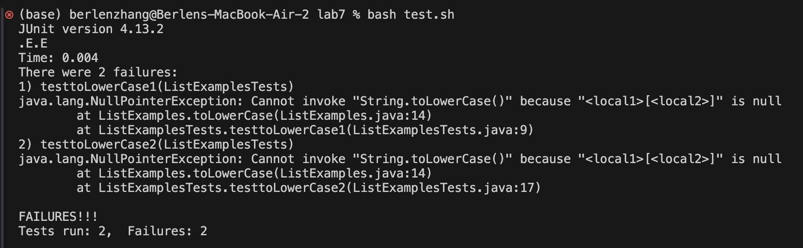
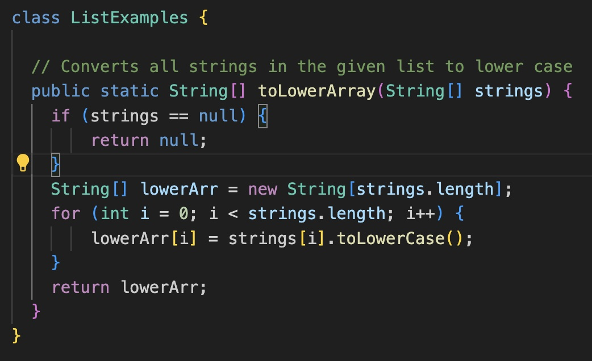
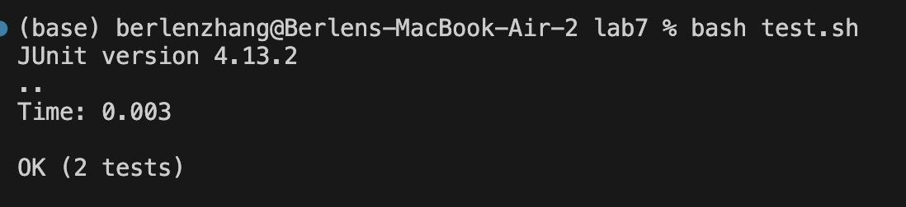

# Lab Report 5

## Part 1: Debugging Scenario

**Student:**
Hi. I can't seem to find the bug in my `toLowerArray` function. I believe there is something wrong with my for-loop or the way I'm assigning values to the output array. Below is my code and my symptom.

**TA:**
Hello! Your for-loop is fine. My suggestion for you would be to pay attention to what variable you are calling `toLowerCase` on and putting into the output array. 

**Fixed Code:**

