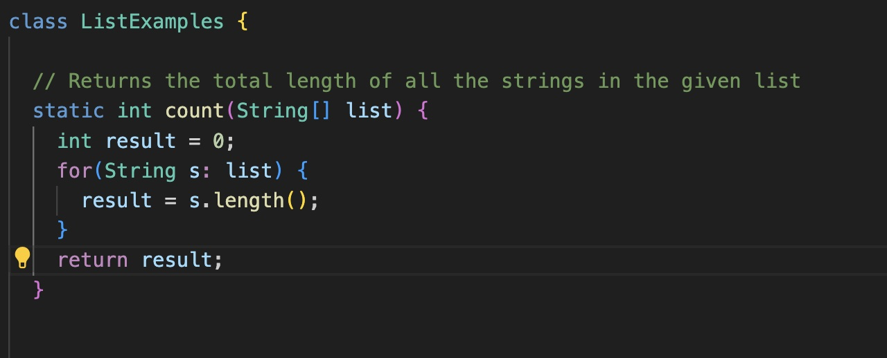
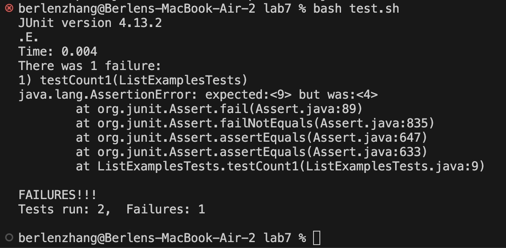
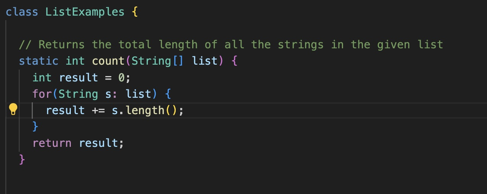
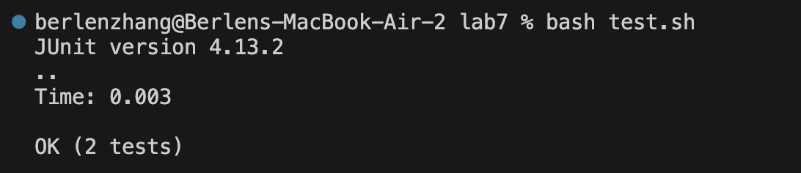
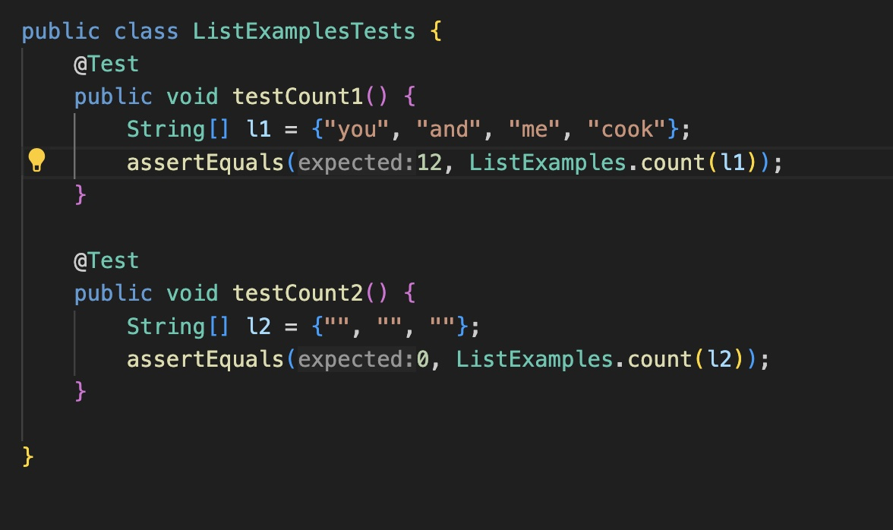
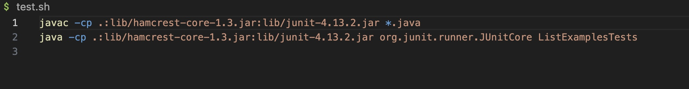

# Lab Report 5

## Part 1 - EdStem Post

**Student Post:**

Hello! I am having trouble finding the error in this code. Can you help me find what's wrong?

This is the error that I am getting.

**Tutor Response:**

Hi. I think you should think about how you are adding the length of each element in the list to the total character count. Is your code implementing what you want to achieve?

**Screenshots:**

**File & Directory Strucure:**
- lab 7
  - ListExamples.java
  - ListExamplesTest.java
  - test.sh
 

**ListExamples.java content:**

**ListExamplesTest.java content:**

**test.sh content:**

**Explanation and Description:**
To trigger the bug, I ran `bash test.sh`. To fix the bug, you have to add a plus sign in front of the equals sign on line 11. This makes sure that the length of each element in the array is added to the `result` variable instead of reassigning it every cycle of the for loop.

## Part 2 - Reflection

My favorite thing I learned in the second half of the quarter was learning how to use Vim. I liked the time trial part of the lab and how we were taught to edit and test files efficiently, using shortcut keys. I think the content of that lab is really useful and will make things convenient in the future. 

